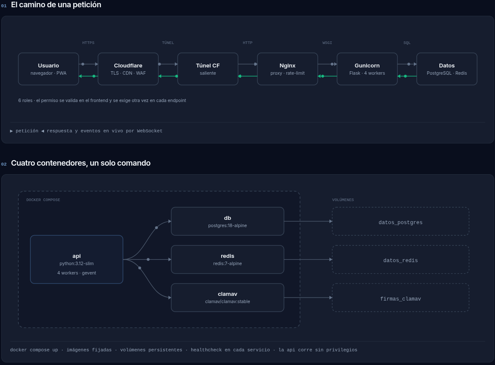
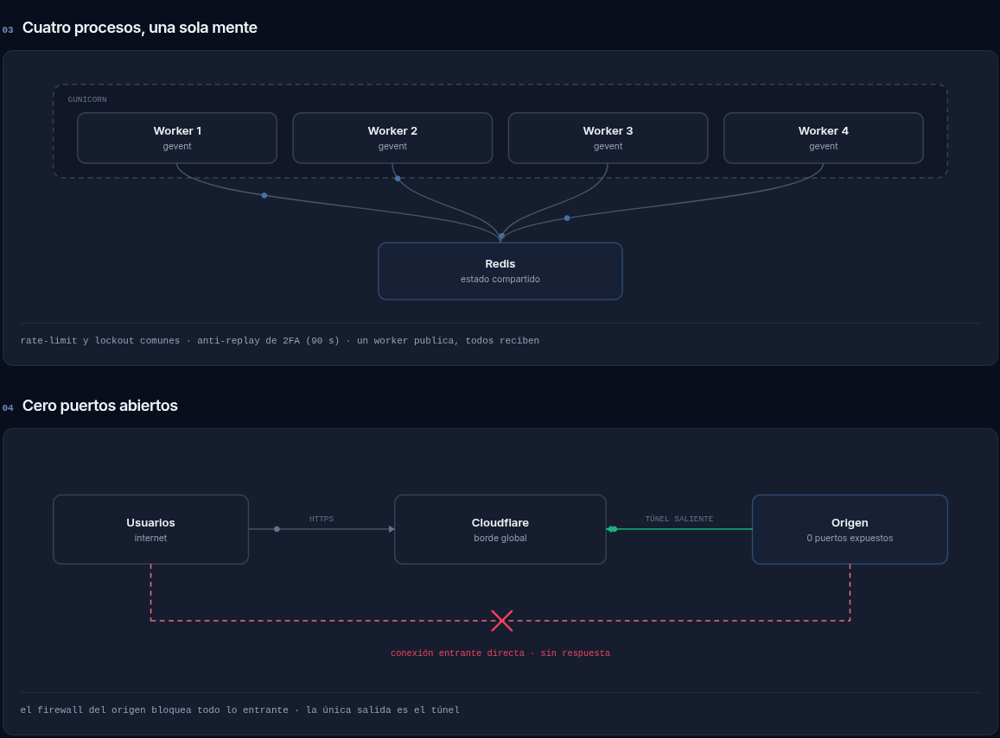
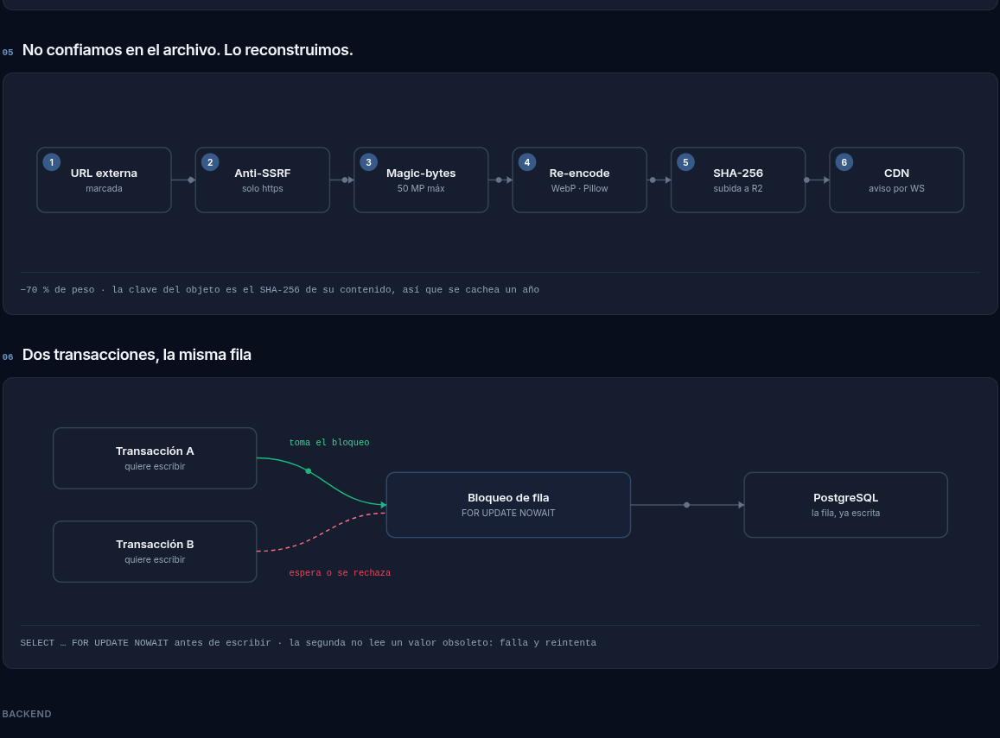
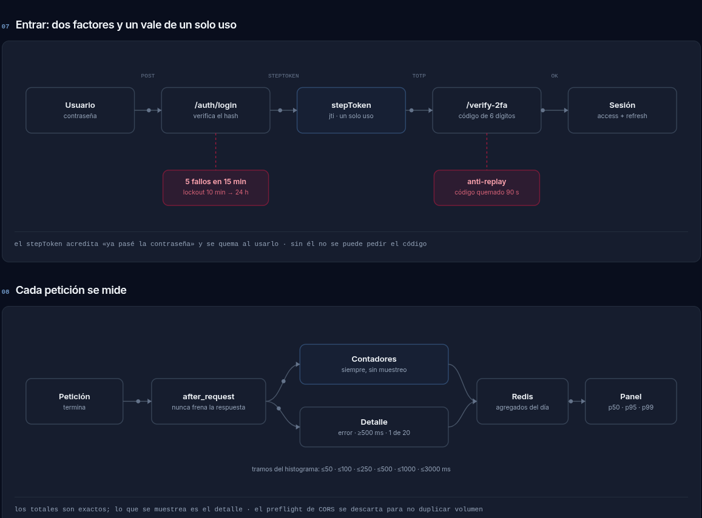
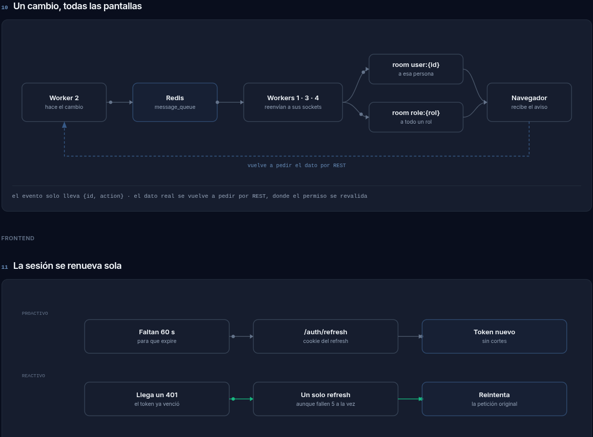

# Sistema de Nóminas — Backend (Skilled ERP)

API JSON en **Flask** que sirve al SPA Skilled ERP (React) para nóminas, empleados, inventario, herramientas y reportes. Despliegue **API-only**: este repo expone `/api/*` y el canal de Socket.IO; el frontend vive en el repo `plantilla-frontend/` y se hostea en Vercel.

---

## Cómo funciona

Los diagramas de abajo resumen las decisiones que más se notan en el día a día: por dónde entra una petición, cómo se reparte entre workers, qué pasa con los archivos y cómo llegan los cambios a la pantalla del usuario. El detalle escrito está en [`docs/RESUMEN_SISTEMA.md`](./docs/RESUMEN_SISTEMA.md) y [`docs/ARQUITECTURA.md`](./docs/ARQUITECTURA.md).

### El camino de una petición y los contenedores



Todo entra por Cloudflare, baja por el túnel, pasa por Nginx y termina en Gunicorn. En local ese mismo camino se levanta con `docker compose up`: api, PostgreSQL, Redis y ClamAV, cada uno con su volumen.

### Cuatro workers y un origen sin puertos abiertos



Los 4 workers de gevent son procesos distintos, así que todo lo que debe ser común —rate-limit, lockout, anti-replay de 2FA, eventos de Socket.IO— vive en Redis. El servidor de origen no publica nada hacia afuera: el túnel es una conexión saliente, y el firewall descarta cualquier intento de conexión entrante directa.

### Archivos que se reconstruyen y escrituras que se serializan



Una imagen que llega de fuera no se guarda tal cual: se valida el host (anti-SSRF), se comprueban los magic bytes, se reescribe con Pillow a WebP y se sube a R2 con el SHA-256 de su contenido como llave. En inventario, dos movimientos que tocan el mismo stock no se pisan porque la fila se toma con `SELECT … FOR UPDATE` antes de escribir.

### Login con 2FA y medición de cada petición



El login parte en dos: la contraseña devuelve un `stepToken` de un solo uso, y solo con él se puede pedir el código TOTP. Aparte, cada respuesta pasa por un `after_request` que suma contadores en Redis y guarda el detalle de las lentas y las que fallan; de ahí salen los p50/p95/p99 del panel de sistemas.

### Realtime y renovación de sesión



El worker que hace un cambio lo publica en Redis y el resto reenvía el evento a sus sockets, por sala `user:{id}` o `role:{rol}`. El evento solo lleva `{id, action}`: el navegador vuelve a pedir el dato por REST, donde el permiso se vuelve a validar. La sesión se renueva sola 60 s antes de expirar, y si aun así llega un 401, varias peticiones en vuelo comparten un único refresh.

---

## Stack

- **API**: Flask 3 + SQLAlchemy 2 + PyJWT + Flask-Limiter + Flask-Talisman
- **DB**: PostgreSQL (psycopg v3) con Alembic para migraciones
- **Redis**: rate-limit, lockout escalado, anti-replay de TOTP y `message_queue` de Socket.IO
- **Realtime**: Socket.IO — `gevent` en prod (WebSocket real), `threading` en dev
- **Archivos**: Cloudflare R2 (bucket público para el catálogo, bucket privado para documentos y fotos, con disco como respaldo) + ClamAV para escanear lo que se sube
- **Documentos**: pandas + openpyxl (Excel), xhtml2pdf + reportlab sobre plantillas Jinja (PDF)
- **Despliegue**: Gunicorn (gevent + `GeventWebSocketWorker`, 4 workers × 1000 conexiones) detrás de Nginx → Cloudflare Tunnel (`protocol: http2`, requerido para WS estable). Imagen Docker disponible para local y VPS.

Por qué cada pieza y la comparativa contra un BaaS tipo Supabase: [`docs/STACK_Y_ALTERNATIVAS.md`](./docs/STACK_Y_ALTERNATIVAS.md).

---

## Qué cubre

- **Empleados**: alta, baja, edición; campos laborales, personales, médicos y financieros con whitelist por rol. Notas internas tipo "chatter" en la ficha (ver `docs/NOTAS_TRABAJADOR.md`).
- **Nómina**: prenómina, descuentos, depósitos extra, préstamos con abonos y el ajuste Inbursa por periodo.
- **Horas**: reportes semanales, registros diarios, ausencias, saldo de vacaciones y captura por RFID/QR.
- **Proyectos M:N**: un trabajador puede estar en varios proyectos; expediente y credenciales derivan la relación SOLO de proyectos activos (ver `docs/PROYECTOS_DERIVACION_M2M.md`).
- **Inventario**: productos, almacenes y estantes con QR; movimientos con lock anti-concurrencia; solicitudes con flujo `PENDIENTE → APROBADA/RECHAZADA/ENTREGADA` y entrega parcial; tomas físicas con ajustes automáticos; etiquetas Avery y órdenes de compra express.
- **Herramientas**: catálogo + unidades físicas rastreables (serie/QR); asignaciones a trabajadores, mantenimientos, incidencias y flujo de baja con autorización.
- **Panel de sistemas**: estado de la infraestructura, tráfico y percentiles, sesiones activas, bloqueos de cuenta, eventos de seguridad y auditoría de archivos huérfanos en R2.
- **Listados ordenables**: trabajadores, préstamos y proyectos aceptan `?sort=<campo>&dir=asc|desc` con whitelist de columnas (ver `docs/ORDENAMIENTO_LISTADOS.md`).
- **Carga masiva**: import/export de plantillas `.xlsx` para empleados y productos.
- **Reportes**: PDF (recibos, constancias, solicitudes, tomas, OC) y Excel (totales por proyecto, histórico), saneados contra fórmula-injection.
- **Realtime**: notificaciones in-app vía Socket.IO, con expiración automática de las leídas a los 30 días.

Los 216 endpoints, uno por uno, están en [`docs/API_REFERENCE.md`](./docs/API_REFERENCE.md).

---

## Requisitos

- Python 3.12 (las imágenes usan `python:3.12-slim`; 3.11 es el mínimo que exige pandas 3)
- PostgreSQL 14+ (los contenedores traen 18)
- Redis — obligatorio: `create_app()` aborta el arranque si no conecta
- Docker + Docker Compose si vas por el camino recomendado
- Git

---

## Puesta en marcha

### Con Docker (recomendado)

```bash
docker compose up --build      # api en http://localhost:5000
```

Levanta la API con su propio PostgreSQL, Redis y ClamAV usando el `.env` de la raíz y una copia de la base `MASTER`. Es la única forma de probar en Windows el camino real de WebSockets con gevent y el antivirus, que en el venv nativo no arrancan. Guía del día a día: [`docs/DIA_A_DIA.md`](./docs/DIA_A_DIA.md). Montaje y despliegue: [`docs/DOCKER.md`](./docs/DOCKER.md).

El VPS **todavía no corre en Docker**; lo que falta y qué lo bloquea está en [`docs/PENDIENTE_PRODUCCION.md`](./docs/PENDIENTE_PRODUCCION.md).

### En un venv

```bash
git clone <repo-url>
cd Skilled-api

python -m venv venv
venv\Scripts\activate           # Windows
source venv/bin/activate        # Linux / Mac

pip install -r requirements.txt

flask db upgrade
python run.py                   # http://localhost:5000
```

Crea la BD en Postgres antes de migrar y deja `SOCKETIO_ASYNC_MODE=threading`: gevent crashea con psycopg en Windows.

### `.env`

Copia [`.env.example`](./.env.example) —documenta todas las variables con sus comandos de generación— y rellena los valores:

```bash
cp .env.example .env
```

Las que importan:

| Variable | Notas |
|---|---|
| `SECRET_KEY` | Obligatoria, la app no arranca sin ella |
| `DATABASE_URL` | Driver psycopg v3: `postgresql+psycopg://...` |
| `TOTP_ENCRYPTION_KEY` | Clave Fernet para cifrar secretos 2FA en BD |
| `REDIS_URL` | Rate-limit, lockout, anti-replay TOTP y message queue de Socket.IO |
| `CORS_ORIGINS` | Dev: Vite (5173). Prod: dominios Vercel/custom |
| `RT_COOKIE_SAMESITE` | `Lax` same-origin (dev); `None` cross-origin (prod) |
| `SOCKETIO_ASYNC_MODE` | `threading` en dev (default); `gevent` en prod y en los contenedores |
| `DB_POOL_SIZE` / `DB_MAX_OVERFLOW` | Pool por proceso (10 + 10 por default). Total = `workers × (pool+overflow) ≤ max_connections` |
| `R2_*` | Bucket público del catálogo + dominio que lo sirve |
| `R2_PRIVADO_*` | Bucket privado de documentos y fotos. Si `R2_PRIVADO_BUCKET` va vacía, todo se queda en disco (`uploads/`) |
| `CLAMAV_HOST` / `CLAMAV_SOCKET` | Demonio del antivirus. `CLAMAV_FAIL_CLOSED=true` en prod |
| `IMG_MAX_DOWNLOAD_BYTES` / `IMG_MAX_PIXELS` | Topes de la descarga de imágenes externas |
| `USE_X_ACCEL_REDIRECT` | `true` solo en prod con nginx configurado |
| `HSTS_PRELOAD` | `false` salvo que estés seguro (semi-irreversible) |
| `POSTGRES_USER` / `POSTGRES_PASSWORD` / `POSTGRES_DB` | Solo para el compose: con ellas crea la base del contenedor |

---

## Estructura del repo

```text
Skilled-api/
├── run.py                  # Entry point; monkey-patch de gevent si SOCKETIO_ASYNC_MODE=gevent
├── requirements.txt        # + constraints.txt
├── Dockerfile              # Imagen de la API (builder + runtime)
├── docker-compose.yml      # Stack de desarrollo (api, db, redis, clamav)
├── docker-compose.prod.yml # Stack del VPS
├── docker/                 # entrypoint, espera de la BD, bootstrap del esquema
├── nginx.config            # Config de Nginx
├── gunicorn.serviceee      # Unit de systemd (se instala como nominas.service)
├── app/
│   ├── __init__.py         # create_app(): CORS, Talisman, Limiter, blueprints, Socket.IO
│   ├── extensions.py       # db, limiter, mail; IP real tras Cloudflare; EncryptedString
│   ├── realtime.py         # Socket.IO: handlers, hooks ORM, emit_to_*
│   ├── observabilidad.py   # after_request: contadores, histograma y detalle en Redis
│   ├── constants.py        # constantes compartidas
│   ├── models/             # SQLAlchemy, 12 módulos por dominio
│   ├── routes/             # 18 blueprints, cada uno como sub-paquete con _core.py
│   └── utils/              # seguridad, archivos, R2, antivirus, imágenes, horas, nómina
├── templates/              # Jinja SOLO para PDFs (xhtml2pdf)
├── migrations/             # Alembic
├── static/                 # Imágenes del catálogo servidas localmente y capturas del README
├── docs/                   # Documentación (ver Referencias)
└── tests/                  # 36 módulos de pytest
```

Detalle completo en [`docs/ARQUITECTURA.md`](./docs/ARQUITECTURA.md).

---

## Producción

Cadena: **Cloudflare Tunnel → Nginx (127.0.0.1:80) → Gunicorn (127.0.0.1:8000) → Flask**.

### Gunicorn

El unit instalado en prod se llama **`nominas.service`** (el archivo del repo es `gunicorn.serviceee`):

```bash
sudo cp gunicorn.serviceee /etc/systemd/system/nominas.service
sudo systemctl daemon-reload
sudo systemctl enable --now nominas
sudo systemctl status nominas
```

Resumen del unit (ver el archivo para los comentarios completos):

- **4 workers gevent (`GeventWebSocketWorker`) × 1000 conexiones**: WebSocket real (upgrade HTTP→WS). gthread no implementa el upgrade y eventlet es incompatible con psycopg3 (ver `docs/MIGRACION_EVENTLET_A_GEVENT.md` y `docs/DEPLOY_GEVENT.md`).
- **`SOCKETIO_ASYNC_MODE=gevent`**: activa el `monkey.patch_all()` al inicio de `run.py` y el modo gevent de Flask-SocketIO.
- **`--max-requests 1000` + jitter**: recicla workers para evitar leaks de pandas/openpyxl/xhtml2pdf.
- **`--forwarded-allow-ips=127.0.0.1`**: solo confía en `X-Forwarded-*` desde nginx local — cierra el spoofing de `CF-Connecting-IP`.
- **`--access-logformat`** custom: imprime `X-Real-IP` (no `127.0.0.1`) y el tiempo de request.
- **Hardening systemd**: `ProtectSystem=strict`, `NoNewPrivileges`, `CapabilityBoundingSet=` (drop all), `MemoryDenyWriteExecute=yes` (si gunicorn no arranca tras tocar gevent, lee el comentario de esa línea en el unit).

### Nginx

```bash
sudo cp nginx.config /etc/nginx/sites-available/skilled
sudo ln -s /etc/nginx/sites-available/skilled /etc/nginx/sites-enabled/skilled
sudo nginx -t && sudo systemctl reload nginx
```

Cubre:

- Rate-limit por IP (`api_general` 30/s, `api_auth` 30/min) como segunda capa.
- Real IP de Cloudflare (`set_real_ip_from` + `real_ip_header CF-Connecting-IP`) y confianza en loopback para el túnel.
- Anti-Slowloris (timeouts agresivos) y anti request smuggling (`Connection ""`).
- Bloque dedicado para Socket.IO (`/socket.io/`) con `Upgrade`/`Connection` y `proxy_read_timeout 3600s`.
- Whitelist de métodos HTTP y bloqueo de paths comúnmente escaneados (`.env`, `wp-login.php`, etc.).
- Logs con upstream y tiempos en `/var/log/nginx/skilled_api.access.log`.
- Headers de seguridad delegados a Flask (única fuente de verdad).

CORS se maneja en Flask (`flask_cors` + `CORS_ORIGINS`); no dupliques `Access-Control-*` en nginx.

### Frontend en Vercel

1. Importar el repo `plantilla-frontend/` en Vercel (Vite auto-detect vía `vercel.json`).
2. Env vars: `VITE_API_URL=https://api.tu-dominio.com/api`.
3. Push → deploy automático.

El `.env` del backend debe tener:

```env
CORS_ORIGINS=https://<proyecto>.vercel.app,https://app.skilled.com.mx
RT_COOKIE_SAMESITE=None
FLASK_ENV=production
USE_X_ACCEL_REDIRECT=true
```

### Checklist post-deploy

```bash
curl https://api.tu-dominio.com/health                          # {"status":"ok"}
sudo journalctl -u nominas -n 20 --no-pager                     # IPs reales, no 127.0.0.1
sudo tail -n 20 /var/log/nginx/skilled_api.access.log           # upstream=127.0.0.1:8000 request_time=...
```

En `/etc/cloudflared/config.yml` usa `protocol: http2`: con QUIC los WebSockets de Socket.IO se degradan (ver `docs/WEBSOCKETS_Y_DEPLOY.md`).

Para el login end-to-end desde el dominio de Vercel: DevTools → Network → la respuesta de `/api/auth/login` debe incluir `Set-Cookie: skilled_rt=...; SameSite=None; Secure`.

---

## Inventario y herramientas

Backend bajo `/api/v1/`: paquetes `app/routes/inventario_api/` (materiales) y `app/routes/herramientas_api/` (herramientas). Frontend en `plantilla-frontend/src/pages/inventario/`.

- **Productos**: CRUD + `GET /productos/bajo-minimo/`, `GET /productos/plantilla-importar`, `POST /productos/importar`.
- **Almacenes y estantes**: CRUD + validación por QR (`GET /almacenes/<qr>/validar`) y generación del PNG (`GET /estantes/<id>/qr-image`).
- **Movimientos**: `POST /movimientos/` toma la fila con `with_for_update` para evitar over-selling concurrente; rate-limit 20/min por IP.
- **Solicitudes**: `PATCH /solicitudes/<id>/estado` mueve el flujo PENDIENTE → APROBADA / RECHAZADA / ENTREGADA, con soporte de entrega parcial.
- **Categorías**: `categorias_config` guarda los metadatos visuales (imagen, etc.) aunque la categoría todavía no tenga productos.
- **Herramientas**: unidades con serie y QR, asignación a trabajador, mantenimientos, incidencias y baja con autorización.

---

## Roles

| Rol | Acceso |
|---|---|
| `super_admin` | Todo. Único que administra otros admins. |
| `admin` | Todo excepto crear/eliminar otros admins. |
| `sistemas` | Panel de TI (`/api/sistemas`): infraestructura, sesiones, bloqueos, eventos de seguridad. Exige 2FA activo. |
| `inventario` | Módulo de inventario completo, sin administración de usuarios. |
| `coordinador` | Solo `/horas` y campos médicos/de contacto de los trabajadores de sus proyectos. |
| `solicitante_material` | Solo `/inventario/mis-pedidos`. |
| `user` | Rol por defecto al crear una cuenta; sin acceso a los módulos administrativos. |

---

## Notificaciones

Panel en el sidebar para `admin` y `super_admin`. El push va por Socket.IO (evento `notif:new`, emitido post-commit por un hook ORM) y el polling queda como respaldo.

| Tipo | Origen |
|---|---|
| `REPORTE_CERRADO` | Al cerrar un reporte de horas |
| `PRENOMINA_CERRADA` | Al aprobar/cerrar una prenómina |
| `ACTUALIZACION` | Entradas del `CHANGELOG` de `app/routes/api_notificaciones/_core.py` (hoy vacío) |

Las leídas se eliminan a los 30 días en cada `GET /resumen`, sin cron externo; el plazo se cambia en `DIAS_EXPIRACION`. Las tablas `notificaciones`, `totp_backup_codes` y `trabajador_notas` se autocrean al arrancar (`inspect().has_table()`), así que no necesitan `flask db upgrade`.

---

## Seguridad

Estado tras la auditoría del 2026-05-23 (score 5.8 → 8.4/10; 4 críticas y 7 altas cerradas en código). El detalle completo, con hallazgos y fixes, está en [`docs/SEGURIDAD.md`](./docs/SEGURIDAD.md).

### Autenticación

- **JWT** HS256 con `iss=skilled-erp-api` y `aud=skilled-erp-spa`. Access token corto + refresh rotativo en cookie httpOnly con detección de replay.
- **2FA en dos pasos**: la contraseña devuelve un `stepToken` de un solo uso (con `jti` quemado en Redis) y solo con él se puede verificar el TOTP. El secreto se guarda cifrado con Fernet.
- **Refresh proactivo en el SPA**: renueva el access token 60 s antes de expirar y re-evalúa al volver el foco a una pestaña inactiva (ver `plantilla-frontend/src/api/axios.js`).
- **CSRF**: `/api/auth/refresh` y `/api/auth/logout` exigen `X-Requested-With: XMLHttpRequest` — el header custom fuerza preflight y bloquea POST cross-site desde un `<form>`.
- **Lockout escalado** por IP y usuario en Redis (10 min → 24 h), y anti-replay de TOTP durante 90 s.
- Cambiar la contraseña invalida los JWT en uso mediante `password_version`.

### Autorización

- **Whitelist de campos por rol** en `PUT /api/trabajadores/<id>`: el coordinador solo toca médicos y contacto, el admin los financieros y la PII fiscal; lo prohibido se ignora y vuelve en `warnings`.
- **`/api/dashboard`**: solo admin y super_admin (filtra PII).
- **`/api/auth/users`**: oculta `role`, `totp_enabled` y `last_seen` a los roles no admin.
- **`/api/sistemas`**: exige rol `sistemas` o `super_admin` **y** 2FA activo, y marca todas sus respuestas como `no-store`.
- Solo `super_admin` crea o elimina otros admins, y cambiarle la contraseña a un admin **no** le resetea el 2FA.

### Archivos e inputs

- Documentos de trabajador: PDF, JPG, PNG o HEIC, ≤ 20 MB, validados por magic bytes y no por extensión, y escaneados con ClamAV (`fail closed` en producción).
- Imágenes externas: el host se resuelve y se rechaza si cae en red interna (anti-SSRF, incluidos redirects), tope de bytes y de píxeles, y reescritura completa a WebP con Pillow.
- `imagen_url` solo acepta `https://` o paths `/static/...` locales; bloquea `javascript:`, `data:`, `http://` y `file:///`.
- Prenómina valida `tipo` enum, `concepto` de 1 a 250 chars, `monto` ≤ $999,999.99 y `fecha_incidencia` no futura.

### Infraestructura

- Rate-limit en Nginx (`api_general` 30/s, `api_auth` 30/min) más Flask-Limiter por usuario/IP en Redis.
- Gunicorn con `--forwarded-allow-ips=127.0.0.1` cierra el spoofing de `CF-Connecting-IP`.
- `.env` con `chown root:sistemanominas` y `chmod 640`, no legible por otros usuarios del host.
- Hardening systemd completo en `gunicorn.serviceee` (ProtectKernel*, RestrictAddressFamilies, CapabilityBoundingSet vacío, MemoryDenyWriteExecute).
- Toda mutación relevante escribe en `audit_log` con usuario, IP y acción, y se empuja en vivo al panel de bitácora.

### Pendientes operativos (no se resuelven desde el repo)

1. **Rotar credenciales**: Postgres (`ALTER USER ... WITH PASSWORD '...'` y actualizar `DATABASE_URL`) y el App Password de Gmail (https://myaccount.google.com/apppasswords). Si `.env` llegó a commitearse: `git filter-repo --invert-paths --path .env --force && git push --force --all`.
2. **Firewall del origin** (ufw): `deny 8000` desde cualquier origen que no sea localhost, para que filtrar la IP real no baste para saltarse Cloudflare.
3. **DNS limpio**: `dig api.skilled.com.mx +short` debe devolver solo IPs de Cloudflare.
4. **Cloudflare WAF**: Bot Fight Mode y rate-limit en `/api/auth/login` (5/min/IP).

### Higiene continua

| Tarea | Frecuencia | Comando |
|---|---|---|
| `pip-audit` | mensual | `pip-audit -r requirements.txt` |
| `npm audit` | mensual | `cd plantilla-frontend && npm audit --production` |
| Revisar bitácora | semanal | UI `/bitacora` o `SELECT * FROM audit_log WHERE action ILIKE '%fallido%' ORDER BY created_at DESC LIMIT 50;` |
| Backup BD + archivos | diario | `pg_dump nominas \| gzip > backup_$(date +%F).sql.gz` |
| Rotar `SECRET_KEY` | semestral | `python -c "import secrets; print(secrets.token_urlsafe(64))"` + restart |
| Re-pentest externo | anual | — |

---

## Comandos útiles

```bash
# Migraciones
flask db migrate -m "descripción"
flask db upgrade
flask db current

# Tests (correrlos tras cualquier cambio)
pytest tests/

# Docker
docker compose up -d               # levantar en segundo plano
docker compose logs -f api         # logs de la API
docker compose exec api sh         # entrar al contenedor
docker compose exec api pytest     # tests dentro del contenedor
```

Las plantillas de Excel no se generan con ningún script: se descargan de `GET /api/trabajadores/plantilla-importar` y `GET /api/v1/productos/plantilla-importar`.

---

## Referencias

Archivos de despliegue: [`nginx.config`](./nginx.config), [`Dockerfile`](./Dockerfile), [`docker-compose.prod.yml`](./docker-compose.prod.yml), [`gunicorn.serviceee`](./gunicorn.serviceee) (se instala como `nominas.service`). Frontend: repo `plantilla-frontend/`, desplegado en Vercel.

Documentación en [`docs/`](./docs/):

| Doc | Contenido |
|---|---|
| `RESUMEN_SISTEMA.md` | Resumen ejecutivo de una página: qué es, cómo está armado y cómo se protege |
| `ARQUITECTURA.md` | Mapa del código: factory, blueprints, realtime, utils |
| `STACK_Y_ALTERNATIVAS.md` | Tecnologías del backend, por qué cada una y comparativa contra Supabase |
| `API_REFERENCE.md` | Los 216 endpoints, agrupados por blueprint |
| `MODELOS_BD.md` | Todas las tablas, columnas y relaciones |
| `SEGURIDAD.md` | Auditoría completa: hallazgos, fixes y pendientes |
| `DOCKER.md` / `DIA_A_DIA.md` / `PENDIENTE_PRODUCCION.md` | Contenedores en local y en el VPS, y lo que falta para migrar producción |
| `WEBSOCKETS_Y_DEPLOY.md` / `DEPLOY_GEVENT.md` / `MIGRACION_EVENTLET_A_GEVENT.md` | Socket.IO en producción, gevent y por qué no eventlet |
| `FIX_WEBSOCKET_TOKEN_EXPIRADO.md` / `FIX_WEBSOCKET_RECONEXION_MATUTINA.md` | Fixes de reconexión de WS |
| `MIGRACION_ARCHIVOS_A_R2.md` / `ANTIVIRUS_CLAMAV.md` | Almacenamiento en R2 y escaneo de subidas |
| `MIGRACION_USERESOURCE_REALTIME.md` | Migración del módulo de realtime |
| `MANUAL_USO_PRENOMINA_PRESTAMOS_INBURSA.md` | Manual funcional de prenómina, préstamos y ajustes |
| `NOTAS_TRABAJADOR.md` / `ORDENAMIENTO_LISTADOS.md` / `PROYECTOS_DERIVACION_M2M.md` | Notas en la ficha, orden por columna y relación M:N proyectos↔trabajadores |
| `PLAN_ASIGNACION_POR_PROYECTO.md` / `PLAN_MATERIAL_POR_PROYECTO.md` | Planes de asignación y material por proyecto |
| `REFACTOR_ARCHIVOS_GRANDES.md` | Plan y estado del refactor a sub-paquetes |

---

## Licencia

MIT. Puedes usar, copiar, modificar y distribuir este código, incluso comercialmente, conservando el aviso de copyright. El texto completo está en [`LICENSE`](./LICENSE).

---

> _Desarrollado para mantener la contabilidad organizada, veloz e inquebrantable._
